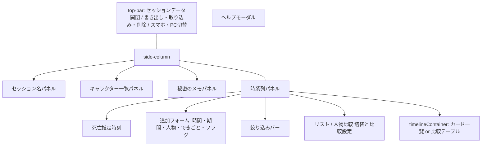

# マダミス専用メモアプリ 設計書（概要）

対象: `マダミス時系列整理.html`（単一HTMLファイル、約2700行。HTML＋CSS＋Vanilla JS）

## 1. 目的
マーダーミステリーのセッション中に、出来事の時系列・登場人物・推理メモを1画面で整理するためのローカル完結型メモアプリ。

## 2. 全体アーキテクチャ
- **単一ファイル構成**: `<style>`（静的CSS＋動的CSS用の空 `<style id="cardColorsStyle">`）、HTML（トップバー／左カラム／時系列パネル／ヘルプモーダル）、`<script>`（全ロジック）の3部構成。
- **状態管理**: グローバル変数（`events`, `characters`, `charFilter`, `flagFilter`, `timelineMode`, `currentView` など）＋ localStorage（キーは `KEYS` に集約）。フレームワーク不使用。
- **描画方式**: 状態変更→`renderEvents()`（リスト）／`renderCompare()`（比較）で `#timelineContainer` を innerHTML で全再構築。フラグ等の軽微な変更のみ `refreshCard()` で部分更新（部分更新はリストビューの非期間カードのみ。比較ビュー・期間イベントは常に全再描画）。

## 3. 画面構成

## 4. 主要データ構造
| 名前 | 内容 |
|---|---|
| `events[]` | `{time, text, characters[], character(互換), color, flag, endTime?, concealed?, colorHidden?, anchor?}` |
| `characters[]` | `{name, color, locked?}` |
| `charFilter[]` / `flagFilter` | 人物絞り込み（複数）／フラグ絞り込み（all/flag/noflag） |
| `compareOrder[]` | 比較ビュー専用の列順（キャラ一覧の順序と独立） |
| `anchor` | 時刻なしカードの手動並び位置（分換算の実数。既定100000で末尾） |

## 5. 主要処理フロー
1. **追加**: `addEvent()` → 正規化（`normalizeTime`）→ push → フォームリセット（`resetAddEventForm`：期間・人物選択を毎回初期化）→ `sortEvents()` → `saveEvents()` → 再描画。
2. **並び順**: `effectiveSortMinutes()`（時刻→分、不詳→anchor or 100000）で安定ソート。
3. **リスト描画**: `buildSortedRows(true)` で行を組み立て（期間は間に他カードがあれば start/end 分割、なければ range 1枚）→ `computeConnectorLayout()` でコの字コネクター（幅25px・段差31px・余白7px、背景右マージンを腕の右端に clamp して「ユ」の字化を防止）→ カードDOM生成 → `alignControlsToShortestCard()` でボタン右端揃え。
4. **比較描画**: `renderCompare()`。列＝絞り込み中の人物（比較専用順）、行＝時刻＋時間不詳（anchor差し込み）＋時間なし。人物列内はレーン分割（期間グループ左・点カード右）、期間は rowspan の塗りセル。CSS `zoom` による倍率。
5. **表示モード**: `applyView()` が `view-pc`/`view-mobile` を決定。PC選択でもモード切替バーが折り返す狭さなら自動的にスマホ表示＋`view-compact`（左カラムだけPCレイアウト維持）。

## 6. 主要関数マップ
| 分類 | 関数 |
|---|---|
| 保存 | `loadJSON` / `safeSet` / `saveEvents` / `persistEvents` / `flushMemoSave`（pagehide・visibilitychange時にメモのデバウンス待ちを即時保存） |
| キャラ | `addCharacter` / `startEditCharacter` / `saveEditCharacter`（全データの名前を一括置換） / `deleteCharacter` / `recolorCharacter` / `lock/unlockCharacter` / `updateCardColorCss` |
| 追加フォーム | `addEvent` / `resetAddEventForm` / `toggleRangeMode` / `toggleNewFlag` / `toggleCharSelectPopup` |
| 時間 | `normalizeTime`（時の先頭ゼロは除去し `H:MM` に統一。言葉混じりの自由記述は加工しない） / `liveFormatTime`（入力中の自動`:`挿入） / `timeToMinutes`（`時:分`完全一致＋分≤59のみ有効） / `effectiveSortMinutes` |
| リスト | `buildSortedRows` / `computeConnectorLayout` / `renderEvents` / `refreshCard` / `alignControlsToShortestCard` / `relocateUnknownMoveButtonsIfNeeded` |
| カード操作 | `startEditEvent`・`saveEditEvent`（フル編集）/ `applyEventEdit`（リスト編集・比較編集共通の保存処理）/ `handleDoubleEnterSave`（Enter素早く2回保存の共通判定）/ `startEditTime`・`saveEditTime`（時間だけ）/ `toggleEventFlag`・`toggleEventConceal`・`toggleEventColor` / `deleteEvent` / `moveUnknownEvent` / `toggleCardChar` |
| 比較 | `renderCompare` / `compareColumns` / `moveCompareColumn` / `startCompareEdit`・`saveCompareEdit` / `changeCompareZoom` |
| 死亡推定 | `populateDeathSelects` / `onDeathTimeChange` / `isInDeathRange`（日跨ぎ対応） |
| 色 | `safeColor` / `colorForChar` / `textColorFor`（輝度で文字色） / `mutedBorderColor`（ボタン枠線） / `rangeColor`（コネクター色） |
| その他 | `init`（起動時の初期化一式。ファイル末尾で1回だけ呼ぶ） / `applyView` / `setView` / `exportData` / `importData` / `clearAll*` / `toggleHelp` |

## 7. セキュリティ設計
- 全ユーザー入力は `escapeHtml` を通して DOM に挿入。
- 色は `safeColor` で `#RRGGBB` のみ許可。動的CSSのセレクタはキャラ名でなくインデックス（`char-idx-{i}`）。
- 外部通信なし・localStorage 完結。

## 8. 関連ドキュメント
- [機能要件.md](機能要件.md) — 挙動再現に必要な全仕様（色・寸法含む、PC/スマホ別）
- [非機能要件.md](非機能要件.md) — 品質特性の要件
- [README.md](README.md)
